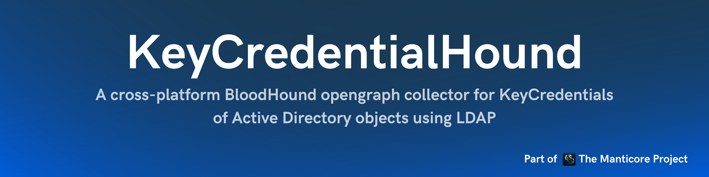

<p align="center">
  A cross-platform BloodHound opengraph collector for KeyCredentials of Active Directory objects using LDAP.
  <br>
  
  <a href="https://twitter.com/intent/follow?screen_name=podalirius_" title="Follow"></a>
  <a href="https://www.youtube.com/c/Podalirius_?sub_confirmation=1" title="Subscribe"></a>
  <br>
   <a href="https://specterops.io/bloodhound-enterprise/" title="Get BloodHound Enterprise"></a>
  <a href="https://specterops.io/bloodhound-community-edition/" title="Get BloodHound Community"></a>
  <br>
</p>


## Features

- [x] Read Key Credentials from LDAP
- [x] Export to BloodHound OpenGraph JSON format

## Graph model

Every kind is prefixed with the `KC_` namespace, both to stay clear of BloodHound built-ins and because structured graph extension schemas require kind names of the form `{namespace}_{Name}`. The source kind of the collection is `KC_Base`.

| Node kind | What it is |
|---|---|
| `KC_KeyCredential` | One value of the `msDS-KeyCredentialLink` attribute of a principal |
| `KC_RSAPublicKey`, `KC_DSAPublicKey`, `KC_ECCPublicKey` | The key material a key credential registers |
| `KC_RSAPrivateKey`, `KC_DSAPrivateKey`, `KC_ECCPrivateKey` | Same, for a private key blob. The attribute is meant to carry public keys only, so such a node is a finding on its own |
| `KC_UnknownKeyMaterial` | Key material absent from the blob or of an unparsed type, see `key_material_status` |
| `KC_Device` | The device a key credential was registered from, from the optional `DeviceId` entry |

| Edge | Meaning |
|---|---|
| `(principal)-[:KC_HasKeyCredential]->(:KC_KeyCredential)` | The principal carries this key credential |
| `(:KC_KeyCredential)-[:KC_HasKeyMaterial]->(keyMaterial)` | The credential registers this key material |
| `(:KC_Device)-[:KC_RegisteredKeyCredential]->(:KC_KeyCredential)` | The credential was registered from this device |
| `(keyMaterial)-[:KC_CanAuthenticateAs]->(principal)` | Whoever holds the matching private key can authenticate as the principal through PKINIT, and recover its NT hash from the PAC |

The first three edges describe how the collected objects relate to each other. `KC_CanAuthenticateAs` is the one that carries an attack, and is the edge to mark traversable in an extension schema: it runs from the key material to the principal it authenticates, which is the direction an attacker moves in.

## Cypher queries

### Find principals that share the same key material than another principal in their key credentials.

One key material node is shared by every credential registering that key, so principals sharing a key are the ones a single key material node authenticates:

```cypher
MATCH (km)-[:KC_CanAuthenticateAs]->(p)
WITH km, collect(p) AS principals
WHERE size(principals) > 1
RETURN km, principals
```

The same thing over the descriptive edges, which returns the paths rather than the principals:

```cypher
MATCH x=(p1)-[:KC_HasKeyCredential]->(:KC_KeyCredential)
      -[:KC_HasKeyMaterial]->(km)<-[:KC_HasKeyMaterial]-
      (:KC_KeyCredential)<-[:KC_HasKeyCredential]-(p2)
WHERE p1 <> p2
RETURN x
```

### Find one device registered against several principals.

```cypher
MATCH (d:KC_Device)-[:KC_RegisteredKeyCredential]->(:KC_KeyCredential)<-[:KC_HasKeyCredential]-(p)
WITH d, collect(DISTINCT p) AS principals
WHERE size(principals) > 1
RETURN d, principals
```

### Find key credentials registered but never used.

A key credential created recently and never used reads very differently from one in daily use, which makes this the first query to run when hunting shadow credentials:

```cypher
MATCH (p)-[:KC_HasKeyCredential]->(kc:KC_KeyCredential)
WHERE kc.last_logon_time IS NULL
RETURN p, kc
ORDER BY kc.creation_time DESC
```

### Find private keys published in the attribute.

```cypher
MATCH (p)-[:KC_HasKeyCredential]->(:KC_KeyCredential)-[:KC_HasKeyMaterial]->(km)
WHERE km.key_is_private
RETURN p, km
```

## Examples from BloodHound

### All key credentials

```cypher
MATCH x=(p)-[:KC_HasKeyCredential]->(:KC_KeyCredential)-[:KC_HasKeyMaterial]->(km)
RETURN x
```

The graph showing all key credentials of all Active Directory objects looks like this:


### Find principals that share the same key material than another principal in their key credentials.

```cypher
MATCH x=(p1)-[:KC_HasKeyCredential]->(:KC_KeyCredential)-[:KC_HasKeyMaterial]->(km)<-[:KC_HasKeyMaterial]-(:KC_KeyCredential)<-[:KC_HasKeyCredential]-(p2)
WHERE p1 <> p2
RETURN x
```

The graph showing principals that share the same key material looks like this:


### Key attributes

The key attributes can be seen in their properties like this:


## Usage

```
./KeyCredentialHound -h
Usage: KeyCredentialHound [--debug] [--output-file <string>] [--domain <string>] [--username <string>] [--password <string>] [--hashes <string>] --dc-ip <string> [--port <tcp port>] [--use-ldaps] [--use-kerberos]

  --debug                    Debug mode. (default: false)
  -o, --output-file <string> Output file name. (default: "")

  Authentication:
    -d, --domain <string>   Active Directory domain to authenticate to. (default: "")
    -u, --username <string> User to authenticate as. (default: "")
    -p, --password <string> Password to authenticate with. (default: "")
    -H, --hashes <string>   NT/LM hashes, format is LMhash:NThash. (default: "")

  LDAP Connection Settings:
    -dc, --dc-ip <string> IP Address of the domain controller or KDC (Key Distribution Center) for Kerberos. If omitted, it will use the domain part (FQDN) specified in the identity parameter.
    -P, --port <tcp port> Port number to connect to LDAP server. (default: 389)
    -l, --use-ldaps       Use LDAPS instead of LDAP. (default: false)
    -k, --use-kerberos    Use Kerberos instead of NTLM. (default: false)
```

## Custom icons

`set-custom-icons.py` registers a Font Awesome icon for every kind the collector emits. Each algorithm gets its own glyph and each visibility its own color, so a private key published in the attribute stands out at a glance:

```
./set-custom-icons.py -H bloodhound.corp.com -P 443 --use-https -b <bearer token>
```

Without `--use-https` the bearer token is sent in cleartext, which the script warns about for any host but the loopback.

## Output files

KeyCredentialHound writes **two** JSON files per run:

1. `<output>.json` — the collector's own nodes (key credentials, key material and devices) and the `KC_HasKeyMaterial` and `KC_RegisteredKeyCredential` edges between them, tagged with the `KC_Base` source kind.
2. `<output>_cross_collector.json` — only the edges that reach existing Active Directory principals, `KC_HasKeyCredential` and `KC_CanAuthenticateAs`. This file carries **no** source kind.

Upload the main file first, then the cross-collector file. Splitting them this way ensures the `KC_Base` source kind is never applied to your Active Directory nodes, so deleting the collector's data later does not delete AD principals.

Run SharpHound first. The cross-collector edges reach principals by SID, and a SID that BloodHound has never seen becomes a bare node carrying nothing but that SID.

## Node identifiers

Node ids are built from stable values, so that re-running the collector updates the existing nodes instead of duplicating them:

- `KC_KeyCredential` — `<accountSID>.<keyID>`, namespaced by the account's `objectSid` so the id survives renames and OU moves.
- Key material — `<keyID>.<nodeKind>`. The key ID is a digest of the key material, so the same key registered on several principals collapses into a single node. This is what makes the shared key material query above work.
- `KC_Device` — `KC_Device.<deviceGUID>`.

Both the `KeyCredential` separator and the `KC_Device` prefix matter: the `DeviceId` entry is attacker controlled, and a bare GUID id would let a crafted key credential name the `objectGUID` of an existing OU, GPO or container. The device node would then merge into that object, hanging an edge off it and stamping it with the collector's source kind.

The key ID is stored in `msDS-KeyCredentialLink` as hexadecimal in link versions 0 and 1, but as base64 in version 2. It is therefore normalized to lowercase hexadecimal before being used in an id: without that, the same key carried by two different link versions would produce two distinct key material nodes and go undetected. Both forms are kept as properties, `identifier` as collected and `key_id_hex` normalized, so queries can match on the normalized value without knowing the link version:

```cypher
MATCH (kc:KC_KeyCredential {key_id_hex: "a1b2c3d4..."})
RETURN kc
```

## Node properties

`KC_KeyCredential` nodes carry the account they were collected from, so that they can be attributed and scoped to a domain on their own, without having to resolve the edge to Active Directory: `account_sid`, `account_distinguishedname`, `domain` and `domainsid`.

Timestamps are reported as Unix epoch seconds in `creation_time` and `last_logon_time`, so that they can be compared and sorted in a query, next to an ISO 8601 form in `creation_time_iso` and `last_logon_time_iso`.

`source`, `legacy_usage`, `creation_time`, `last_logon_time` and the `cki_*` properties come from optional entries of the blob, and are only set on nodes whose key credential carries them.

Key material nodes carry `key_algorithm`, `key_size_bits` and `key_is_private`, along with the algorithm's own fields under an `rsa_`, `dsa_` or `ecc_` prefix. **The secret components of a private key are deliberately left out**, and `key_secret_omitted` records that: writing them would turn the graph database, and the JSON exported to reach it, into a store of private keys readable by everyone with access to either. Only sizes and public components are reported.

### Upgrading from an earlier version

Every node and edge kind was renamed into the `KC_` namespace, the source kind included, and node ids changed as key IDs of version 2 key credentials were previously used base64-encoded and are now hexadecimal. Saved queries written against the old names have to be updated, and re-ingesting over an older collection creates new nodes next to the old ones.

Delete the `KeyCredentialBase` source kind in BloodHound before the first upload with this version, and re-run `set-custom-icons.py` to register the new kinds. Deleting that source kind never affects Active Directory nodes, since the cross-collector edges are uploaded separately.

## Contributing

Pull requests are welcome. Feel free to open an issue if you want to add other features.
